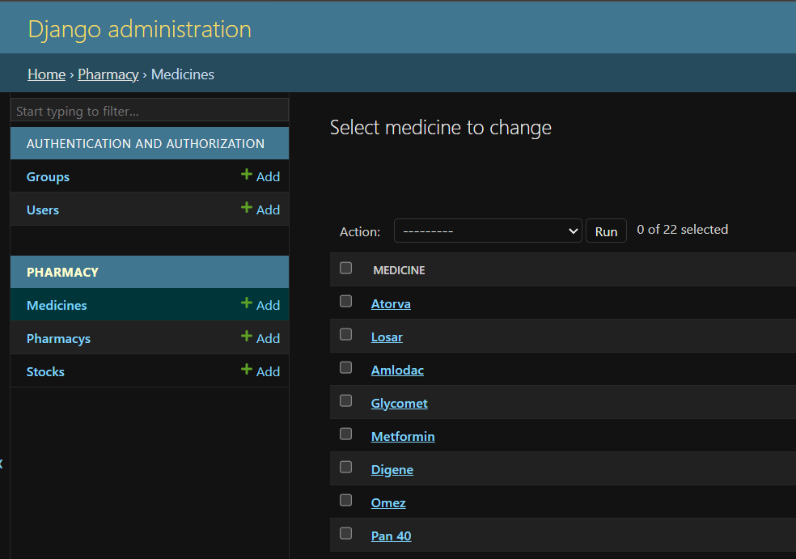
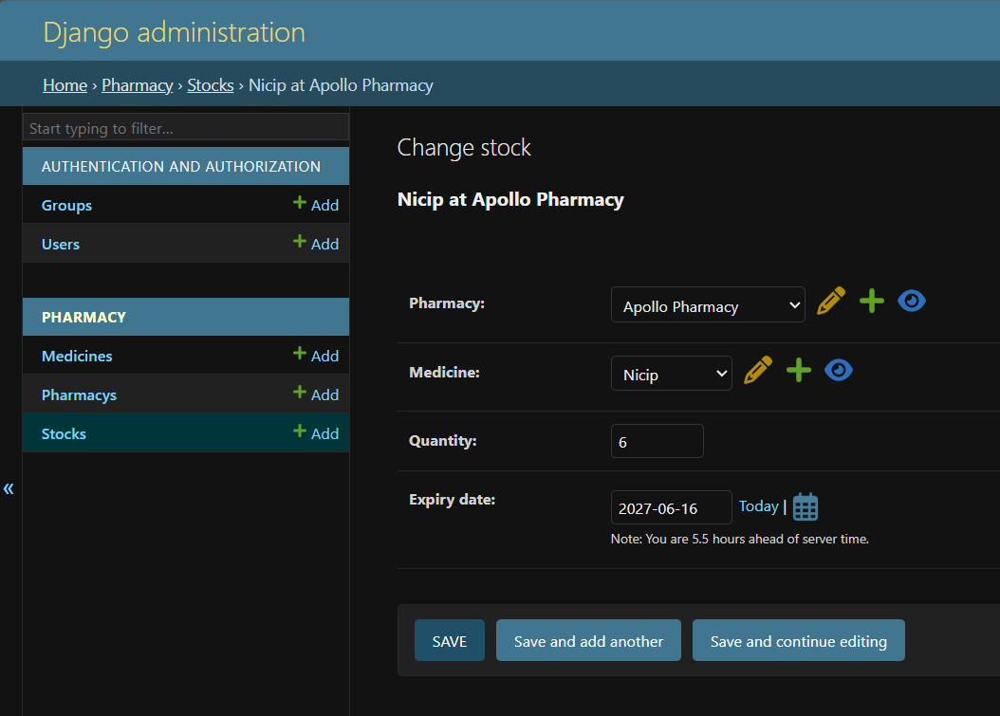

# 💊 Medicine Availability Finder

A Django-based web application that helps users search and check medicine availability across pharmacies with location and stock details.

---

## 🚀 Features
- Medicine Search
- Pharmacy Availability
- Stock Quantity Display
- User-Friendly Interface

---

## 🛠️ Technologies Used
- Python
- Django
- HTML
- CSS
- JavaScript
- SQLite / MySQL

---

## ⚙️ Run Project

```bash
python manage.py runserver
```

---

## 🖼️ Screenshots

```md






```

---

## 🔗 GitHub Repository


---

